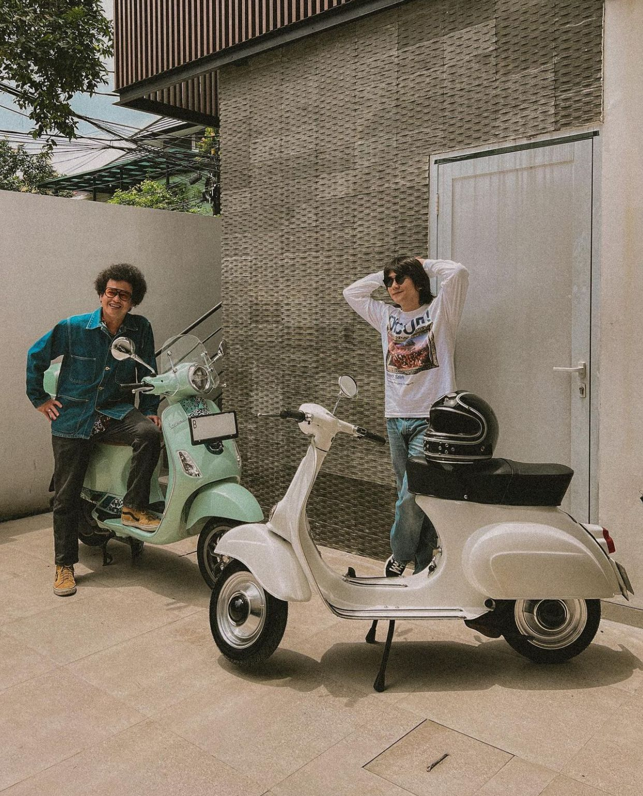

<!DOCTYPE html>
<html lang="en">
<head>
  <meta charset="UTF-8">
  <meta name="viewport" content="width=device-width, initial-scale=1.0">
  <link rel="stylesheet" href="styles.css">
  <title>curriculum vitae</title>
</head>
<body>
  <header>
    <h1>Haaaiiiii ;)</h1>
  </header>
  <main class="main">
    <section class="profile">
      
      <h2>Ghina Alyaa Farraas</h2>
      
Iyaa emang huruf nya double, setau ku sih cuma aku doang yang a nya 2 terus r nya 2 juga. Biasa dipanggil Gina, mahasiswi ITK dari prodi Sistem Informasi dengan NIM 10221056. Hobi ku main bola voli, desain tipis-tipis, dan checkout shopee.

      
• Tempat, Tanggal Lahir :  Balikpapan, 29 September 2004

      
• Jenis Kelamin :  Perempuan

      
• Agama :  Islam

      
• Kewarganegaraan :  Indonesia

      
• Alamat :  Perum Graha Mulawarman Blok J No. 21

      
• Email :  ghina5752@gmail.com

    </section>
    <section class="ceritapendek">
      <h2>Cerita Pendek🛵</h2>
      
Di sebuah kota kecil di Italia, hiduplah seorang pemuda bernama Luca. Luca adalah pecinta sejati kendaraan klasik, dan salah satu harta terbesarnya adalah Vespa tua warisan dari kakeknya. Vespa merah tua ini adalah kendaraan yang telah mengalami banyak perjalanan dan menyimpan banyak kenangan.
        Suatu hari, Luca memutuskan untuk mengambil Vespa-nya untuk perjalanan yang berbeda. Dia ingin mengikuti jejak kakeknya yang dulu pernah menjelajahi pedesaan dengan Vespa ini. Luca mengisi tangki bensin Vespa, mengenakan jaket kulitnya, dan memutuskan untuk berangkat.
        Dia meluncur dengan hati-hati di jalan-jalan kecil pedesaan yang indah, melewati ladang-ladang hijau dan perbukitan yang mengagumkan. Angin sepoi-sepoi dan sinar matahari yang hangat membuat perjalanan semakin menyenangkan. Vespa yang sudah tua itu mungkin tidak secepat sepeda motor modern, tetapi membawanya ke tempat-tempat yang indah dan penuh kenangan.

      
Luca berhenti sejenak di sebuah desa kecil di tengah perjalanan. Dia parkir Vespa di depan kafe yang ramai, dan dia memesan espresso. Saat duduk di meja kafe yang teduh, dia mendengarkan cerita-cerita dari penduduk desa tentang Vespa klasiknya. Mereka berkisah tentang bagaimana Vespa adalah simbol kebebasan dan petualangan di zaman dulu.
        Setelah minum kopi dan berbicara dengan orang-orang desa, Luca melanjutkan perjalanannya. Dia mengejar matahari terbenam di atas bukit yang tinggi, menikmati pemandangan matahari terbenam yang indah.
        Perjalanan ini memberikan Luca pengalaman yang tak terlupakan. Vespa klasiknya bukan hanya kendaraan, tetapi juga membawanya kembali pada kenangan-kenangan indah bersama kakeknya. Perjalanan itu adalah penghargaan atas warisan keluarganya dan sebuah petualangan yang akan selalu diingat oleh Luca, sebuah kisah tentang cinta untuk Vespa dan kenangan masa lalu yang terjaga dengan baik.

      
    </section>
    <section class="video">
      <h2>Video📺</h2>
      <iframe width="560" height="315" src="https://www.youtube.com/embed/1EDyxJU1Kjc?si=WgqX46uAj7WXMLwm" title="YouTube video player" frameborder="0" allow="accelerometer; autoplay; clipboard-write; encrypted-media; gyroscope; picture-in-picture; web-share" allowfullscreen></iframe>
    </section> 
  </main>
</body>
</html>
